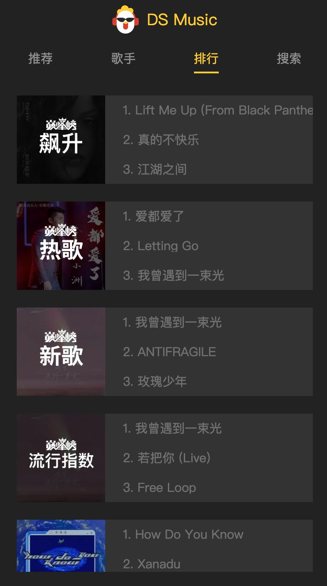
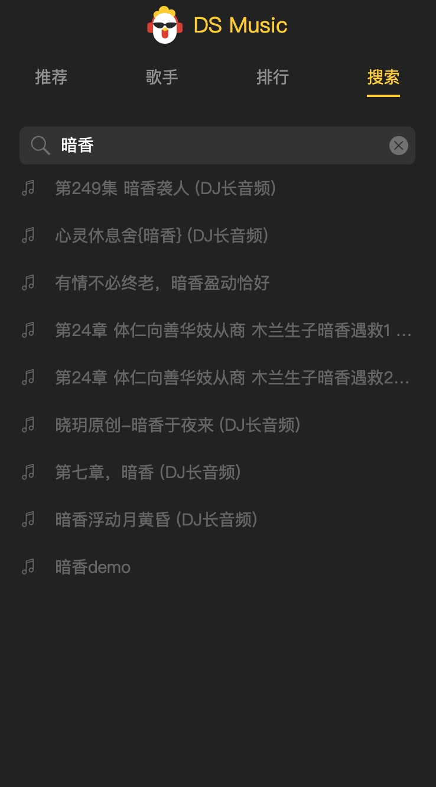

# Vue3-Music-App

基于Vue 3 + TypeScript + Vite + TSX + Pinia 开发的一个音H5乐播放器
+ 在线体验: http://119.3.214.158/music-app
+ Git项目地址: https://github.com/dingsheng1214/vue3-music-app


## 本地安装

```sh
# 安装依赖
pnpm install
# 启动后端接口转发服务器
node backend/prod.server.js
# 启动前端
pnpm dev
```
## UI
### 推荐页面


### 歌手页面


### 排行页面


### 搜索页面


### 全屏播放


### mini播放

